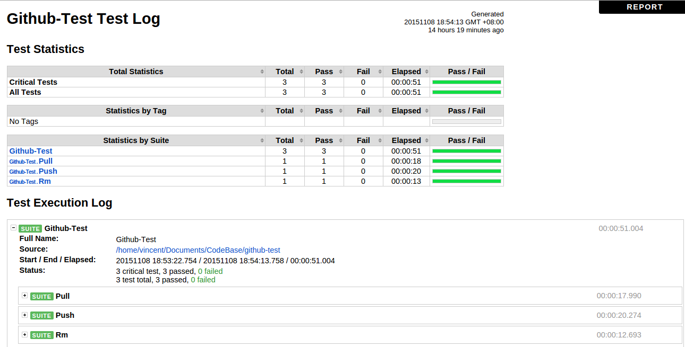

# GitHub Test

## Preconditions

A precondition for running the tests is having [Robot Framework](http://robotframework.org) and [RequestsLibrary](https://github.com/bulkan/robotframework-requests/) installed, and they in turn require [Python](https://www.python.org/).

Also these are required:

* [Git](http://www.git-scm.com/)
* Some linux tools, like base64 

All these are tested on **Ubuntu 14.04** via **GitHub api v3**.

Here's an example installation script for Ubuntu:

```
sudo apt-get -y update
sudo apt-get install -y python
sudo apt-get install -y python-pip
sudo apt-get install -y git
pip install robotframework
pip install requests
pip install robotframework-requests

```

## Running tests

To execute all tests use:

``` 
pybot --variable USER:[YOUR_GITHUB_USER_NAME] --variable PASSWORD:[YOUR_GITHUB_PASSWORD] --variable YOUR_GITHUB_REPO:[YOUR_EXIST_GITHUB_REPO] .
```

> Notes:
> * YOUR_EXIST_GITHUB_REPO should be **created** before running tests
> * Make sure you add **SSH key** to your GitHub before running tests

## Report
[report](report/report.html)

[log](report/log.html)

